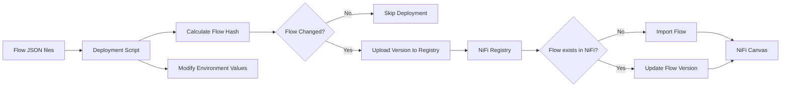
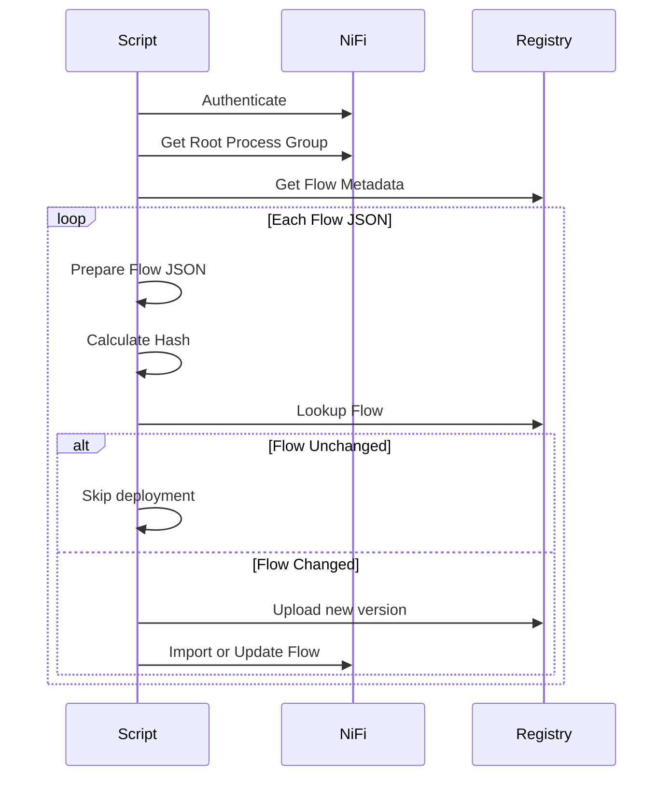
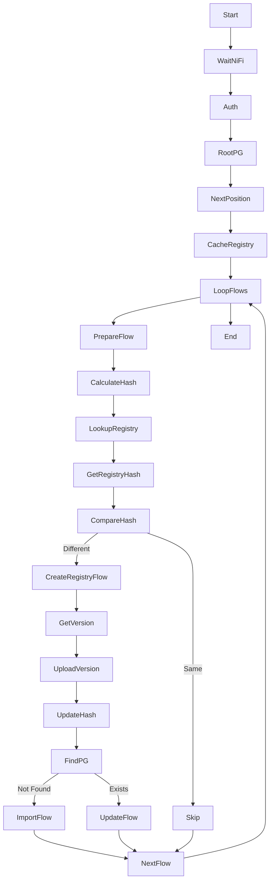
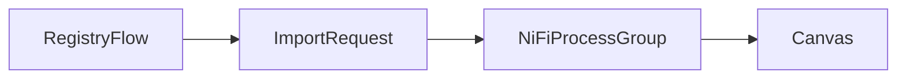
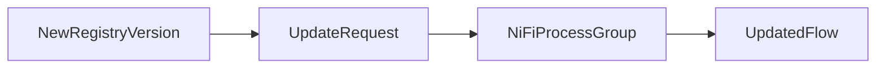
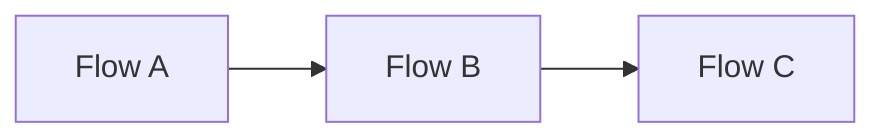
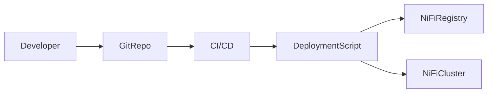

NiFi Flow Deployment Automation

Overview

This script automates deployment of versioned flows into Apache NiFi using NiFi Registry.

It performs the following tasks:
•	Reads flow JSON files
•	Updates environment-specific values
•	Calculates flow and parameter hashes
•	Detects if deployment is required
•	Creates or updates flow versions in registry
•	Imports or updates flows in NiFi
•	Avoids unnecessary deployments

This ensures idempotent deployments across environments.

High Level Architecture




Deployment Workflow



Script Execution Flow



Environment Variables

Variable
Description
SINGLE_USER_CREDENTIALS_USERNAME
NiFi login user
SINGLE_USER_CREDENTIALS_PASSWORD
NiFi login password
REGISTRY_ID
NiFi registry client ID
REGISTRY_BUCKET_ID
Registry bucket containing flows
TARGET_RPG_URL
Remote Process Group target URL
FRAGMENT_MANAGER_URL
Fragment manager endpoint
NIFI_URL
NiFi API base URL
REGISTRY_URL
NiFi Registry API base URL


Flow JSON Processing

Before deployment, the script modifies flow JSON:

Remote Process Group URLs

```jql
.flowContents.remoteProcessGroups[].targetUris
```


Updated to:

```jql

TARGET_RPG_URL
```

Fragment Manager Parameter

```jql

fragment-manager-url
```

Updated to:

```jql

FRAGMENT_MANAGER_URL


```


Hash Based Deployment Control

To prevent unnecessary deployments, hashes are calculated.

Flow Hash

Based on:

```jql

.flowContents
```

Positions are ignored.
```jql

jq -S '.flowContents | del(.. | .position?)'

```


Parameter Hash

Based on:

```jql
.parameterContexts


```


Combined Hash

```jql
FLOW_HASH + "_" + PARAM_HASH


```


Example:

```jql

9a8f12a_7bcde21
```

Registry Flow Metadata

Registry flow descriptions store the hash.

Example:

```jql

description = flow-hash:9a8f12a_7bcde21
```

This allows detecting whether deployment is required.

⸻

Deployment Logic

Condition
Action
Flow not in registry
Create registry flow
Hash unchanged
Skip deployment
Hash changed
Create new version
Flow not in NiFi
Import flow
Flow exists in NiFi
Update version


Flow Import

If flow does not exist in NiFi:



Position is automatically assigned.

Flow Update

If flow already exists:



Flow Positioning

New flows are positioned automatically.

```

X position = max existing + POSITION_STEP
Y position = 300
```

Example layout:



Logging

Script uses structured logging.

Example:

```
[INFO] 2026-03-12 10:21:11 Flow hash: 912ab21
[INFO] 2026-03-12 10:21:11 Registry hash: 912ab21
[INFO] Flow unchanged. Skipping deployment.
```


Deployment Example

```

flows/
 ├── billing.json
 ├── payments.json
 └── circuit-manager.json
 
 ```
Script processes each file sequentially.

Failure Handling

The script exits immediately if any command fails.

```
set -euo pipefail
```

This prevents partial deployments.

Advantages of This Approach

Deterministic deployments

Flows only deploy when changes exist.

Environment independent

URLs and parameters are injected dynamically.

CI/CD friendly

Script can run inside:
•	Kubernetes Jobs
•	CI pipelines
•	GitOps workflows

Registry version tracking

Each deployment creates a new registry version.

Recommended Deployment Architecture




