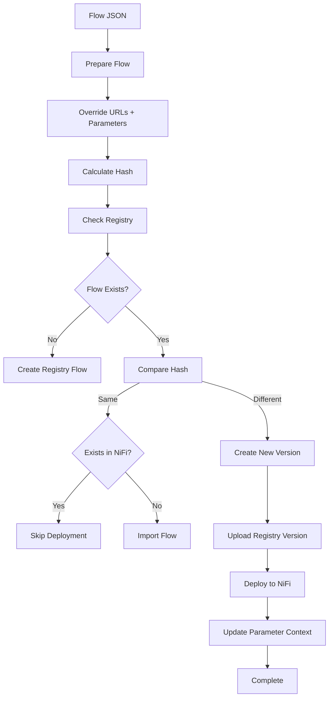

NiFi Flow Deployment Script – Documentation

📌 Overview

This script automates deployment of flows to:
•	Apache NiFi
•	NiFi Registry

It ensures:
•	✅ Idempotent deployments (hash-based)
•	✅ Automatic flow import/update
•	✅ Parameter override per environment
•	✅ Registry version management
•	✅ No unnecessary redeployments




Configuration

Required Environment Variables

```
SINGLE_USER_CREDENTIALS_USERNAME
SINGLE_USER_CREDENTIALS_PASSWORD

REGISTRY_ID
REGISTRY_BUCKET_ID

TARGET_RPG_URL
FRAGMENT_MANAGER_URL

NIFI_URL
REGISTRY_URL
```


Script Components

⸻

1️⃣ Authentication

wait_for_nifi()

Waits until NiFi authentication endpoint is ready.

authenticate()

Retrieves JWT token:

```
POST /nifi-api/access/token
```

2️⃣ Flow Discovery

get_root_pg()

Gets root process group ID.

get_next_position()

Calculates placement position for new flows.

⸻

3️⃣ Registry Cache

cache_registry_flows()

Loads all flows from registry once:

```
GET /nifi-registry-api/buckets/{bucket}/flows

```


4️⃣ Flow Preparation

prepare_flow()

Modifies flow JSON:

✔ Updates RPG URLs
✔ Overrides parameters globally


```jql
(.. | objects | select(has("parameters")) | .parameters)

```

5️⃣ Hash Calculation

calculate_hash()

Generates deployment fingerprint:

```
FLOW_HASH  = flow structure
PARAM_HASH = parameter context
LOCAL_HASH = combined
```


Used for:

```
Skip unnecessary deployments
```

6️⃣ Registry Operations

lookup_registry_flow()

Finds flow by name.

get_registry_hash()

Reads stored hash from:

```
flow.description = flow-hash:<value>
```

7️⃣ Version Management

create_registry_flow()

Creates new registry flow if missing.

get_latest_version()

Gets latest version and increments.

upload_registry_version()

Uploads new version:

```
POST /flows/{flowId}/versions

```

update_registry_hash()

Stores hash for future comparisons.

⸻

8️⃣ NiFi Deployment

find_pg()

Checks if flow exists in NiFi.

import_flow()

Creates new process group:

```
POST /process-groups/root/process-groups
```

update_flow_version()

Updates existing flow:

```
POST /versions/update-requests/process-groups/{pgId}
```

9️⃣ Parameter Context Override

update_parameter_context()

⚠️ Critical step

NiFi does NOT update parameters automatically.

This function:
•	Finds parameter context
•	Updates runtime value
•	Applies environment-specific config


```
PUT /parameter-contexts/{id}
```

🔁 Deployment Logic

Case Matrix

Scenario
Action
Flow new
Create + version + import
Flow changed
New version + update
Flow unchanged + exists
Skip
Flow unchanged + missing
Import
Registry exists only
Import


🌍 Parameter Handling

Why Needed?

NiFi does NOT sync parameters from registry.

Solution

Script explicitly updates:

```
fragment-manager-url
```

via API.

📊 Example Logs

```
[SECTION] Processing flow: circuit-manager

Flow hash      : abc123
Parameter hash : def456
Registry hash  : abc123_def456

Flow unchanged. Skipping.

```


