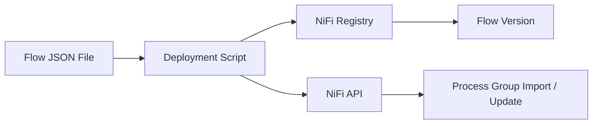
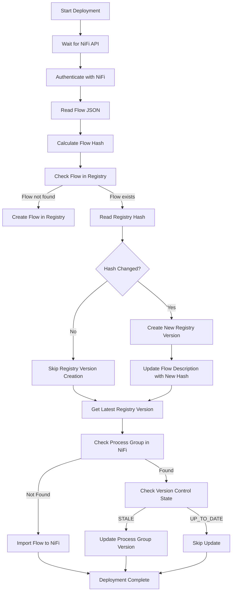
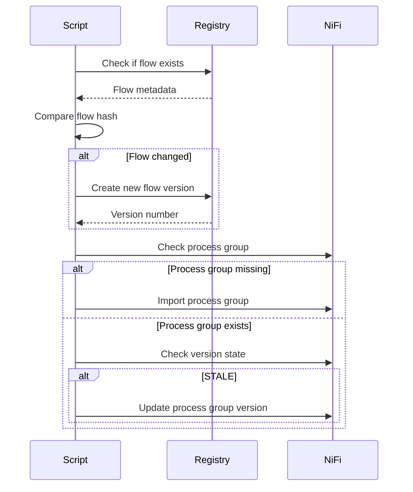
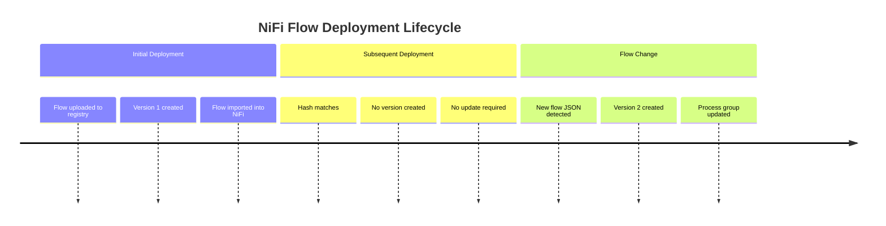

NiFi Flow Deployment Guide

This document explains how NiFi flows are automatically deployed to Apache NiFi using Apache NiFi Registry and a deployment script.

The deployment script ensures:
•	Flows are versioned in NiFi Registry
•	Only changed flows create new versions
•	NiFi Process Groups are imported or updated automatically


Architecture Overview




Deployment Script Responsibilities

The script performs the following tasks:
1.	Waits for NiFi API availability
2.	Authenticates with NiFi
3.	Calculates a hash of the flow JSON
4.	Checks if the flow exists in NiFi Registry
5.	Creates a new flow if it does not exist
6.	Creates a new version only if the flow has changed
7.	Imports the flow into NiFi if the Process Group does not exist
8.	Updates the Process Group if the Registry version is newer


Deployment Flow




Flow Change Detection

To detect flow changes, the script calculates a SHA256 hash of the flow JSON.

Example:

```
LOCAL_HASH=$(jq -S '.' "$FLOW_FILE" | sha256sum | awk '{print $1}')
```
The hash is stored in the flow description in NiFi Registry.

Example:
``
flow-hash:3e4ac8f9e3c78b...

``

On the next deployment:
•	The stored hash is compared with the local hash
•	If they match → deployment is skipped
•	If they differ → a new version is created



Importing a Flow to NiFi

If the Process Group does not exist, the script imports the flow using the NiFi API:

```
POST /nifi-api/process-groups/root/process-groups

```


Payload structure:

```
{
  "revision": {
    "version": 0
  },
  "component": {
    "name": "Flow Name",
    "position": {
      "x": 0,
      "y": 0
    },
    "versionControlInformation": {
      "registryId": "...",
      "bucketId": "...",
      "flowId": "...",
      "version": 1
    }
  }
}

```

Updating a Flow Version

If the Process Group already exists and is STALE, the script updates it:

```mermaid
POST /nifi-api/versions/update-requests/process-groups/{pgId}

```

Payload:

```
{
  "processGroupRevision": {
    "version": 3
  },
  "versionControlInformation": {
    "version": 2
  }
}


```

Deployment Script Inputs

Parameter
Description
FLOW_FILE
Path to the NiFi flow JSON file
BUCKET_ID
NiFi Registry bucket ID
NIFI_USERNAME
NiFi login username
NIFI_PASSWORD
NiFi login password


Deployment Outcomes

Scenario
Result
Flow does not exist
Flow created in Registry
Flow unchanged
No new version created
Flow changed
New Registry version created
Process group missing
Flow imported into NiFi
Process group outdated
Process group updated


Benefits of This Deployment Approach
•	Prevents unnecessary Registry versions
•	Ensures idempotent deployments
•	Fully automated flow promotion
•	Works well with CI/CD pipelines
•	Supports Git-based flow management



