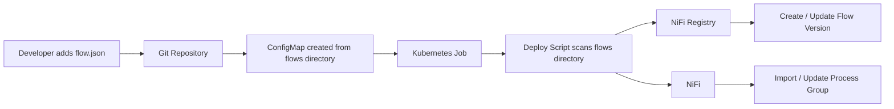
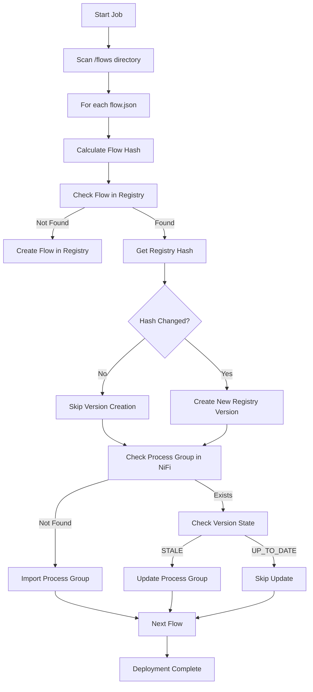

# NiFi Flow Deployment (Directory‑Driven)

This document explains how NiFi flows are deployed automatically using a Kubernetes job that scans a directory of flow definitions.

The deployment interacts with:

- Apache NiFi
- Apache NiFi Registry

## Overview

Instead of specifying a single flow file, the deployment job scans all files in a **flows directory**. Each flow JSON file found in this directory is deployed automatically.

The flows directory is mounted into the Kubernetes job using a **ConfigMap**.

---

# Architecture Overview



---

# Kubernetes Deployment Model

The deployment script runs inside a **Kubernetes Job**.

The job mounts a directory containing flow definitions.

Example directory structure inside the container:

```
/flows
  api-gateway.json
  ingestion.json
  analytics.json
```

Each file is treated as an independent NiFi flow.

---

# ConfigMap Mount

The flows directory is typically created from a ConfigMap.

Example Kubernetes configuration:

```yaml
apiVersion: batch/v1
kind: Job
metadata:
  name: nifi-flow-deployer
spec:
  template:
    spec:
      restartPolicy: Never
      containers:
      - name: deployer
        image: nifi-deployer:latest
        command: ["/scripts/deploy.sh"]
        volumeMounts:
        - name: flows
          mountPath: /flows
      volumes:
      - name: flows
        configMap:
          name: nifi-flows
```

---

# Deployment Script Behaviour

The script performs the following steps:

1. Wait for NiFi API to become available
2. Authenticate with NiFi
3. Scan `/flows` directory
4. For each flow JSON file:
   - Calculate flow hash
   - Check if the flow exists in NiFi Registry
   - Create flow if missing
   - Compare hashes
   - Create a new version if the flow changed
   - Import or update the Process Group in NiFi

---

# Flow Deployment Logic



---

# Flow Change Detection

The deployment script calculates a SHA256 hash of the flow JSON.

Example:

```
jq -S '.' flow.json | sha256sum
```

This hash is stored in the flow description in NiFi Registry:

```
flow-hash:abc123...
```

If the hash matches on the next deployment, the flow is skipped.

---

# Benefits of This Deployment Model

- Supports multiple flows automatically
- No need to configure flows individually
- Works with GitOps workflows
- Ensures idempotent deployments
- Prevents unnecessary flow versions

---

# Example Deployment Output

```
Scanning flows directory...

Deploying api-gateway.json
Flow changed → creating new version
Updating process group

Deploying ingestion.json
Flow unchanged → skipping

Deployment complete
```

---

# Summary

The deployment job:

- Mounts flow definitions via a ConfigMap
- Scans the flows directory
- Deploys each flow automatically
- Uses NiFi Registry for version control
- Updates NiFi only when flows change
