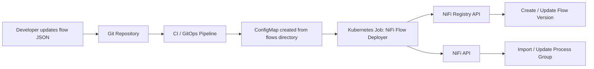
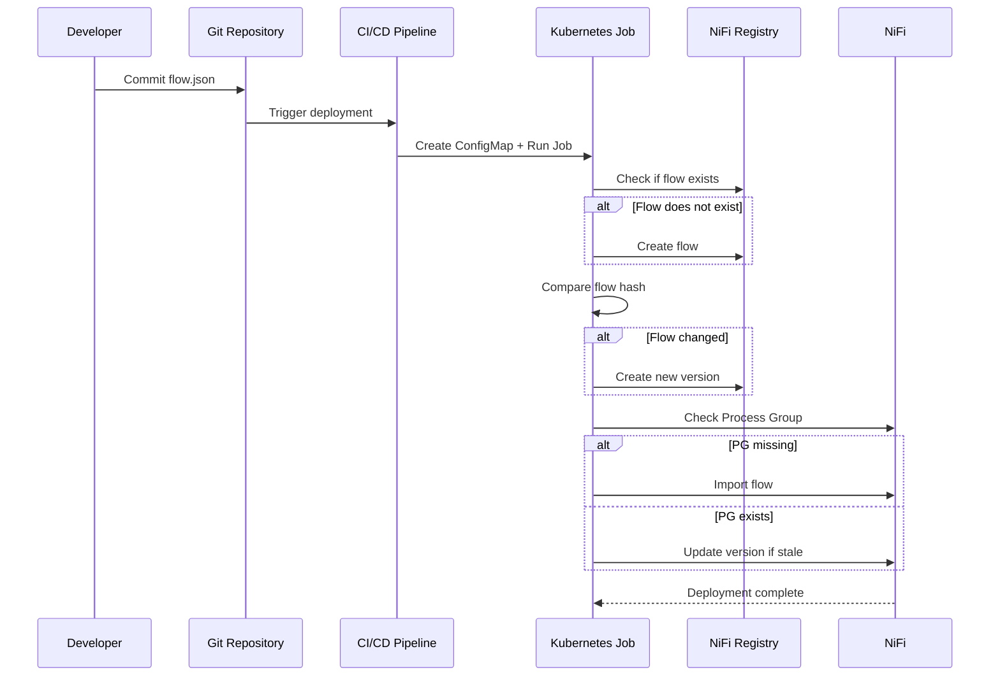

# NiFi Flow Deployment Pipeline

This document describes the full deployment pipeline used to automatically deploy NiFi flows from Git into Apache NiFi using Kubernetes and NiFi Registry.

The pipeline connects the following components:

Git → ConfigMap → Kubernetes Job → NiFi Registry → NiFi

---

# Architecture Diagram



---

# Deployment Flow



---

# Kubernetes Job Overview

The deployment logic runs inside a Kubernetes Job which mounts a directory containing NiFi flow definitions.

Example directory mounted in the container:

```
/flows
  api-gateway.json
  ingestion.json
  analytics.json
```

Each JSON file represents a NiFi flow that will be deployed.

---

# ConfigMap Flow Mount

The flows directory is created from a Kubernetes ConfigMap.

Example configuration:

```yaml
apiVersion: batch/v1
kind: Job
metadata:
  name: nifi-flow-deployer
spec:
  template:
    spec:
      restartPolicy: Never
      containers:
      - name: deployer
        image: nifi-deployer:latest
        command: ["/scripts/deploy.sh"]
        volumeMounts:
        - name: flows
          mountPath: /flows

      volumes:
      - name: flows
        configMap:
          name: nifi-flows
```

---

# Flow Change Detection

To prevent unnecessary deployments, the pipeline calculates a hash of each flow JSON file.

Example:

```
jq -S '.' flow.json | sha256sum
```

This hash is stored inside the flow description in NiFi Registry:

```
flow-hash:abc123...
```

During the next deployment:

- If the hash matches → no new version is created
- If the hash differs → a new flow version is created

---

# Deployment Behaviour

| Scenario | Result |
|--------|--------|
| Flow does not exist | Flow created in Registry |
| Flow unchanged | Deployment skipped |
| Flow changed | New Registry version created |
| Process group missing | Flow imported into NiFi |
| Process group stale | NiFi upgraded to latest version |

---

# Benefits of This Pipeline

- Fully automated NiFi deployments
- Git-driven flow management
- Version control through NiFi Registry
- Idempotent deployments
- Compatible with Kubernetes and GitOps workflows

---

# Example Deployment Output

```
Scanning flows directory...

Deploying api-gateway.json
Flow changed → creating new version
Updating process group

Deploying ingestion.json
Flow unchanged → skipping

Deployment complete
```
