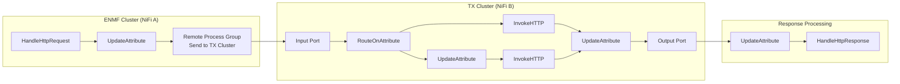
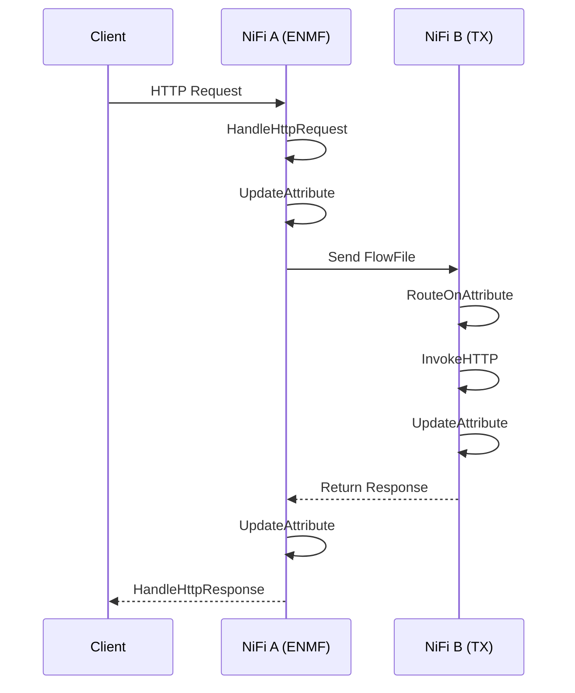
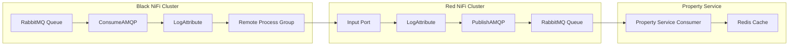
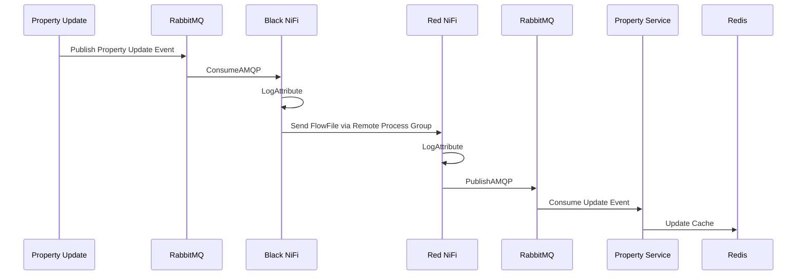

High-Level Flow

NiFi A (ENMF Cluster)

1. HandleHttpRequest
2. UpdateAttribute
3. Send request to Remote Process Group (NiFi B)

NiFi B (TX Cluster)

1. Input Port receives request from NiFi A
2. RouteOnAttribute
3. Route based on request type
    * Path 1 → InvokeHTTP
    * Path 2 → UpdateAttribute → InvokeHTTP
4. Merge response path
5. UpdateAttribute
6. Output Port sends response back to NiFi A

NiFi A (ENMF Cluster)

1. Receive response from NiFi B
2. UpdateAttribute
3. HandleHttpResponse


Wiki Documentation

Circuit Manager Request Processing Flow

Overview

This flow enables ENMF NiFi to receive an incoming HTTP request, forward it to the TX Cluster for processing, and return the response back to the original caller.

Components

ENMF Cluster (NiFi A)


Processor

Purpose

HandleHttpRequest

Receives incoming HTTP request

UpdateAttribute

Adds required metadata and routing attributes

Remote Process Group

Transfers FlowFile to TX Cluster

UpdateAttribute

Processes returned response

HandleHttpResponse

Sends response back to client


================


Processing Sequence

1. Client sends HTTP request to ENMF Cluster.
2. HandleHttpRequest creates a FlowFile.
3. Request attributes are updated using UpdateAttribute.
4. FlowFile is transferred to TX Cluster through a Remote Process Group.
5. TX Cluster receives the request via an Input Port.
6. RouteOnAttribute determines the processing route.
7. Appropriate InvokeHTTP processor calls the target backend service.
8. Response is captured and enriched using UpdateAttribute.
9. Response is sent back to ENMF Cluster via Output Port.
10. ENMF Cluster receives the response.
11. Final attributes are updated.
12. HandleHttpResponse returns the response to the original client.






===============


This looks like a Property Synchronization Flow between two NiFi clusters using RabbitMQ/AMQP.

⸻

Property Synchronization Architecture

Overview

When a property is updated in the Property Service:

1. The update event is published to a RabbitMQ queue.
2. Black NiFi consumes the update event.
3. Black NiFi forwards the event to Red NiFi using a Remote Process Group.
4. Red NiFi receives the event and republishes it to its local RabbitMQ queue.
5. Property Service consumes the message.
6. Property Service updates Redis cache with the latest property data.


End-to-End Flow


Property Update
│
▼
RabbitMQ Queue
│
▼
Black NiFi
(ConsumeAMQP)
│
▼
Remote Process Group
│
▼
Red NiFi
(Input Port)
│
▼
PublishAMQP
│
▼
RabbitMQ Queue
│
▼
Property Service
│
▼
Redis Cache Update


Detailed Flow Description

1. Black NiFi – Consuming Property Updates

Purpose:
Consume property update events from RabbitMQ and forward them to the remote NiFi cluster.


Processors


Processor

Purpose

ConsumeAMQP

Reads property update messages from RabbitMQ

LogAttribute

Logs message metadata for monitoring/troubleshooting

Remote Process Group

Sends messages to Red NiFi


```
RabbitMQ
   │
   ▼
ConsumeAMQP
   │
   ▼
LogAttribute
   │
   ▼
Remote Process Group
```


2. Red NiFi – Publishing Property Updates

Purpose:
Receive property updates from Black NiFi and publish them into the local RabbitMQ queue.

Processors


Processor

Purpose

Input Port

Receives FlowFiles from Black NiFi

LogAttribute

Logs received message details

PublishAMQP

Publishes message to RabbitMQ


3. Property Service

Purpose:
Consume replicated property updates and refresh Redis cache.


```
RabbitMQ
   │
   ▼
Property Service Consumer
   │
   ▼
Redis Update
```






