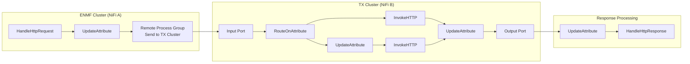
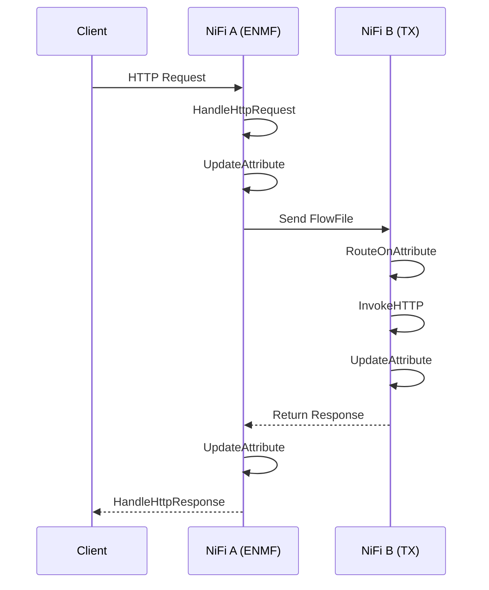
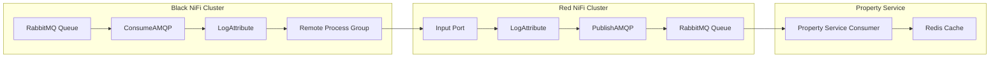
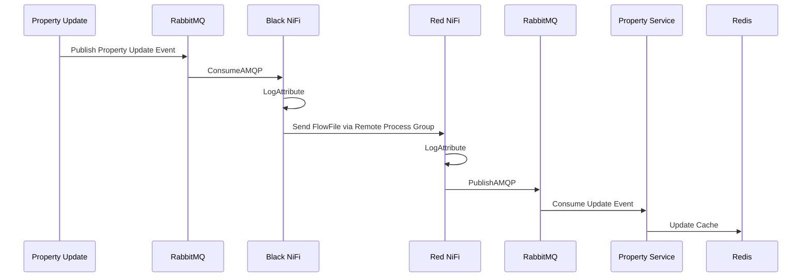

High-Level Flow

NiFi A (ENMF Cluster)

1. HandleHttpRequest
2. UpdateAttribute
3. Send request to Remote Process Group (NiFi B)

NiFi B (TX Cluster)

1. Input Port receives request from NiFi A
2. RouteOnAttribute
3. Route based on request type
    * Path 1 → InvokeHTTP
    * Path 2 → UpdateAttribute → InvokeHTTP
4. Merge response path
5. UpdateAttribute
6. Output Port sends response back to NiFi A

NiFi A (ENMF Cluster)

1. Receive response from NiFi B
2. UpdateAttribute
3. HandleHttpResponse


Wiki Documentation

Circuit Manager Request Processing Flow

Overview

This flow enables ENMF NiFi to receive an incoming HTTP request, forward it to the TX Cluster for processing, and return the response back to the original caller.

Components

ENMF Cluster (NiFi A)


Processor

Purpose

HandleHttpRequest

Receives incoming HTTP request

UpdateAttribute

Adds required metadata and routing attributes

Remote Process Group

Transfers FlowFile to TX Cluster

UpdateAttribute

Processes returned response

HandleHttpResponse

Sends response back to client


================


Processing Sequence

1. Client sends HTTP request to ENMF Cluster.
2. HandleHttpRequest creates a FlowFile.
3. Request attributes are updated using UpdateAttribute.
4. FlowFile is transferred to TX Cluster through a Remote Process Group.
5. TX Cluster receives the request via an Input Port.
6. RouteOnAttribute determines the processing route.
7. Appropriate InvokeHTTP processor calls the target backend service.
8. Response is captured and enriched using UpdateAttribute.
9. Response is sent back to ENMF Cluster via Output Port.
10. ENMF Cluster receives the response.
11. Final attributes are updated.
12. HandleHttpResponse returns the response to the original client.






===============


This looks like a Property Synchronization Flow between two NiFi clusters using RabbitMQ/AMQP.

⸻

Property Synchronization Architecture

Overview

When a property is updated in the Property Service:

1. The update event is published to a RabbitMQ queue.
2. Black NiFi consumes the update event.
3. Black NiFi forwards the event to Red NiFi using a Remote Process Group.
4. Red NiFi receives the event and republishes it to its local RabbitMQ queue.
5. Property Service consumes the message.
6. Property Service updates Redis cache with the latest property data.


End-to-End Flow


Property Update
│
▼
RabbitMQ Queue
│
▼
Black NiFi
(ConsumeAMQP)
│
▼
Remote Process Group
│
▼
Red NiFi
(Input Port)
│
▼
PublishAMQP
│
▼
RabbitMQ Queue
│
▼
Property Service
│
▼
Redis Cache Update


Detailed Flow Description

1. Black NiFi – Consuming Property Updates

Purpose:
Consume property update events from RabbitMQ and forward them to the remote NiFi cluster.


Processors


Processor

Purpose

ConsumeAMQP

Reads property update messages from RabbitMQ

LogAttribute

Logs message metadata for monitoring/troubleshooting

Remote Process Group

Sends messages to Red NiFi


```
RabbitMQ
   │
   ▼
ConsumeAMQP
   │
   ▼
LogAttribute
   │
   ▼
Remote Process Group
```


2. Red NiFi – Publishing Property Updates

Purpose:
Receive property updates from Black NiFi and publish them into the local RabbitMQ queue.

Processors


Processor

Purpose

Input Port

Receives FlowFiles from Black NiFi

LogAttribute

Logs received message details

PublishAMQP

Publishes message to RabbitMQ


3. Property Service

Purpose:
Consume replicated property updates and refresh Redis cache.


```
RabbitMQ
   │
   ▼
Property Service Consumer
   │
   ▼
Redis Update
```








import groovy.json.JsonOutput
import java.time.Instant

def flowFile = session.get()
if (!flowFile) return

// Read the FlowFile body content
def content = ''
session.read(flowFile, { inputStream ->
content = inputStream.text
} as InputStreamCallback)

// Build OTLP JSON payload with content inside body.stringValue
def payload = [
resourceLogs: [[
resource: [
attributes: [[
key  : 'service.name',
value: [stringValue: flowFile.getAttribute('service.name') ?: 'nifi-pipeline']
]]
],
scopeLogs: [[
scope     : [name: 'nifi'],
logRecords: [[
timeUnixNano: (Instant.now().toEpochMilli() * 1_000_000L).toString(),
severityText: 'INFO',
body        : [stringValue: content],          // <-- FlowFile content here
attributes  : [
[key: 'nifi.flowfile.uuid',     value: [stringValue: flowFile.getAttribute('uuid')]],
[key: 'nifi.flowfile.filename', value: [stringValue: flowFile.getAttribute('filename')]]
]
]]
]]
]]
]

// Write OTLP JSON as new FlowFile body
flowFile = session.write(flowFile, { out ->
out.write(JsonOutput.toJson(payload).getBytes('UTF-8'))
} as OutputStreamCallback)

flowFile = session.putAttribute(flowFile, 'mime.type', 'application/json')

session.transfer(flowFile, REL_SUCCESS)


===============

My career aspiration is to progress into a Technical Lead role,
where I can combine my software engineering expertise with leadership responsibilities.
Over the coming year, I aim to strengthen my skills in technical leadership, solution design, 
stakeholder engagement, and team mentoring. I want to take greater ownership of technical direction, 
support the growth of team members, and help deliver high-quality solutions that align with 
business objectives. By continuing to develop my leadership capabilities and architectural knowledge, 
I hope to contribute more strategically to project and organizational success.


Principled Leadership

You could write something like:

Be Curious

* Explored and evaluated new technologies and architectural patterns to improve system scalability and maintainability.
* Investigated opportunities to modernize existing applications through cloud-native solutions and automation.

Be Kind

* Supported team members through code reviews, knowledge sharing sessions, and mentoring activities.
* Promoted a collaborative and inclusive working environment within the development team.

Be Courageous

* Challenged existing technical approaches when better solutions were identified.
* Proactively raised risks and proposed mitigation strategies for critical projects.

Think Outcomes

* Focused on delivering business value through reliable, maintainable, and high-quality software solutions.
* Improved system performance and reduced operational overhead through process and architecture improvements.

Collaborate

* Worked closely with product owners, architects, business analysts, and operations teams to deliver successful outcomes.
* Contributed to cross-functional discussions and technical decision-making.

Own & Deliver

* Took ownership of key deliverables and ensured commitments were met within agreed timelines.
* Resolved production issues and drove continuous improvements to system reliability.

==================


1. Driving Development Excellence

Objective:
Lead the adoption of engineering best practices, improve code quality, and contribute to architectural decisions that enhance system reliability, maintainability, and performance.

Success Measures:

* Lead at least one significant technical initiative or system improvement.
* Promote coding standards and best practices through reviews and technical discussions.
* Contribute to solution design and architecture reviews.

⸻

2. Mentorship

Objective:
Support the growth of team members by sharing knowledge, providing technical guidance, and fostering a culture of continuous learning.

Success Measures:

* Mentor junior and mid-level developers.
* Conduct knowledge-sharing sessions on relevant technologies and practices.
* Provide constructive feedback through code reviews.

⸻

3. Team Innovation and Continuous Improvement

Objective:
Identify opportunities to improve development processes, automation, and engineering efficiency while encouraging innovation within the team.

Success Measures:

* Propose and implement process improvements.
* Drive automation initiatives that reduce manual effort.
* Evaluate and introduce new tools or technologies where appropriate.

⸻

4. Cultural Improvement

Objective:
Promote collaboration, inclusivity, accountability, and positive team engagement aligned with company values and leadership principles.

Success Measures:

* Encourage open communication and knowledge sharing.
* Support cross-functional collaboration.
* Contribute positively to team culture and employee engagement activities.

These objectives align well with a progression from Senior Software Developer to Technical Lead, as they demonstrate leadership, mentoring, technical ownership, and team influence.


==========performance objectives


. Technical Leadership

Objective:
Take greater ownership of technical decision-making and solution design while supporting the team’s technical growth.

Success Measures:

* Lead technical discussions and design reviews.
* Provide guidance on architecture and implementation approaches.
* Mentor team members and support knowledge sharing.

⸻

4. Operational Excellence

Objective:
Improve system reliability, monitoring, and operational efficiency through automation and continuous improvement initiatives.

Success Measures:

* Reduce manual operational effort through automation.
* Improve observability and monitoring capabilities.
* Support rapid identification and resolution of production issues.

These objectives will show that you’re already operating beyond a typical senior developer level and moving toward a Technical Lead position.
