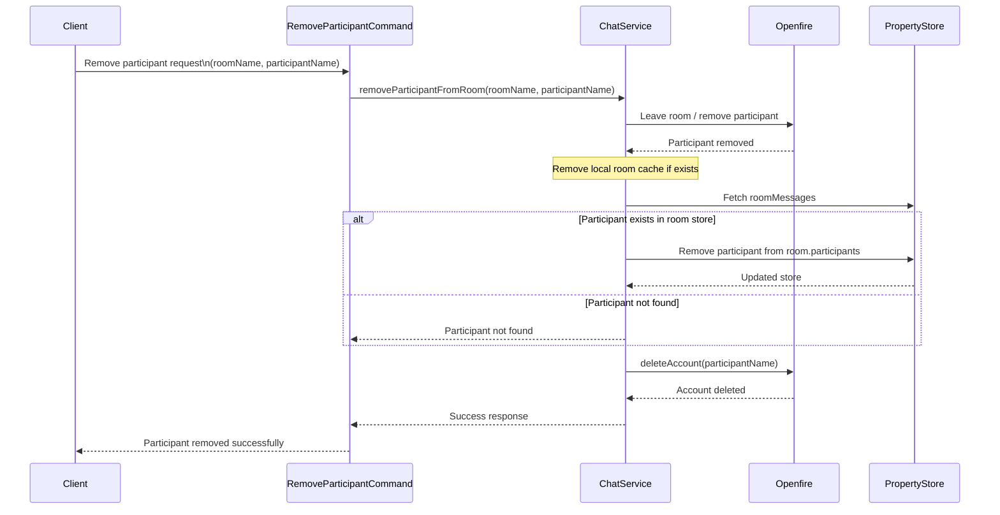
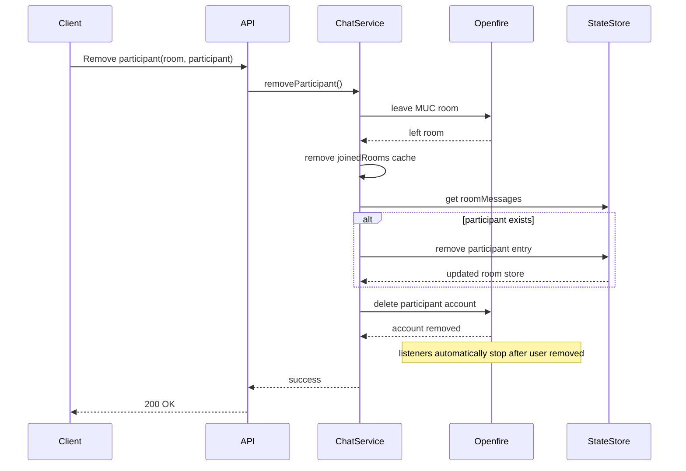
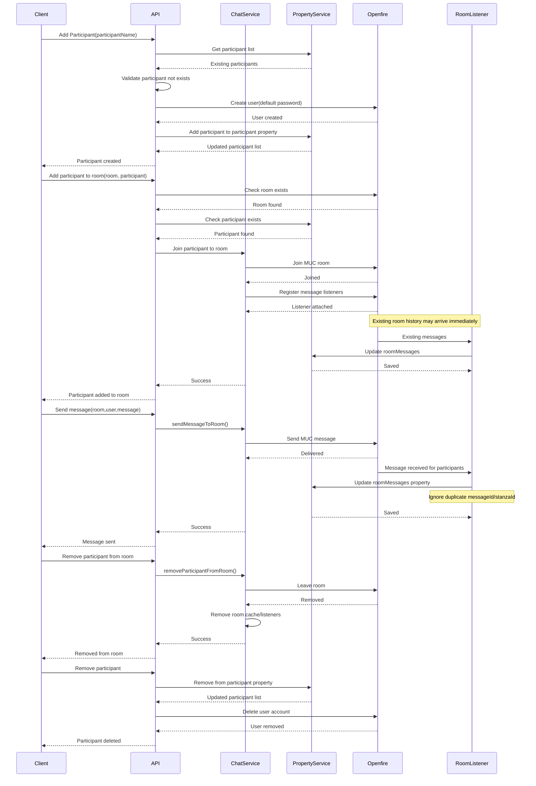

### Chat Room Message Flow Description

This flow manages participants, room membership, message handling, and synchronization between Openfire and the Property Service.

1. Add Participant

When a new participant is created:

1. The system retrieves the existing participant list from the Property Service.
2. It validates whether the participant already exists.
3. If the participant does not exist:
    * A new Openfire user account is created using a default password.
    * The participant is added to the participant property list in the Property Service.
4. The updated participant list is saved.

Result:

* Participant exists in both Openfire and Property Service.

⸻

2. Add Participant to Room

When a participant is added to a room:

1. Validate that the room exists in Openfire.
2. Validate that the participant exists in Property Service.
3. The participant joins the Openfire Multi-User Chat (MUC) room.
4. Message listeners are registered for the participant.
5. Openfire may immediately send existing room history messages.
6. These messages are captured and synchronized into the roomMessages property.

Result:

* Participant joins the room.
* Listeners become active.
* Existing room history becomes available.

⸻

3. Send Message to Room

When a participant sends a message:

1. The request calls sendMessageToRoom().
2. The message is sent to the Openfire room.
3. Openfire distributes the message to room participants.
4. Registered listeners receive the message event.
5. The listener updates the roomMessages property in Property Service.
6. Duplicate prevention is applied using messageId or stanzaId.

Result:

* Message is delivered through Openfire.
* Message history is stored in Property Service.

⸻

4. Remove Participant from Room

When removing a participant from a room:

1. The participant leaves the Openfire room.
2. Room listeners are removed.
3. Cached room references are cleared.

Result:

* Participant no longer receives room messages.
* Memory/cache cleanup occurs.

⸻

5. Remove Participant

When deleting a participant completely:

1. Remove participant from Property Service.
2. Delete the user account from Openfire.
3. Save the updated participant list.

Result:

* Participant is fully removed from the system.


### Message Storage Structure

Messages are stored per room and participant:


```
{
  "roomName": "TestMessage",
  "participants": [
    {
      "participantName": "participant1",
      "messages": [
        {
          "messageId": "XP8H8-4",
          "sender": "participant2",
          "receiver": "participant1",
          "body": "Hello",
          "timestamp": "2026-05-18T05:18:03Z"
        }
      ]
    }
  ]
}
```

This structure allows:

* Room-based storage
* Participant-specific message history
* Read/open tracking extension later
* Duplicate message prevention using messageId or stanzaId
