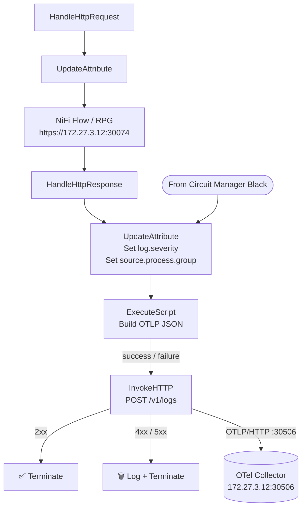
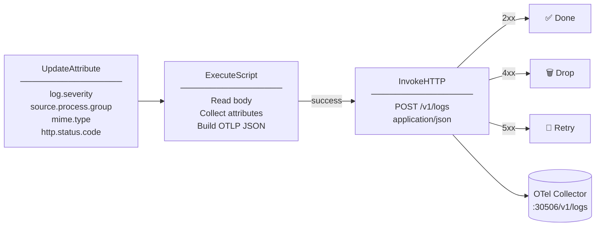
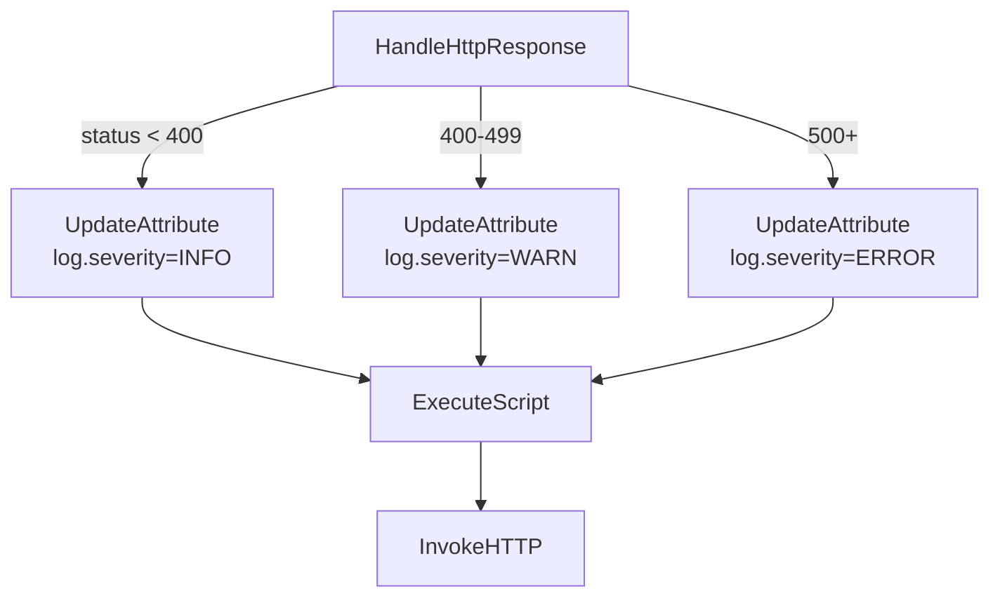

# OpenTelemetry Integration — Circuit Management Flow

Forwards HTTP response data from the Circuit Management Flow to an OpenTelemetry collector via OTLP/HTTP.

---

## Table of Contents

- [Overview](#overview)
- [Architecture](#architecture)
- [Processor Setup](#processor-setup)
- [UpdateAttribute Configuration](#updateattribute-configuration)
- [ExecuteScript — Groovy](#executescript--groovy)
- [InvokeHTTP Configuration](#invokehttp-configuration)
- [Log Severity Mapping](#log-severity-mapping)
- [OTLP Payload Reference](#otlp-payload-reference)
- [Troubleshooting](#troubleshooting)

---

## Overview

After the HTTP request/response cycle completes in the Circuit Management Flow, a dedicated OTel tail is attached to the response path. It captures the response attributes and body, packages them as an OTLP log record, and forwards them to the OpenTelemetry collector.

The `log.severity` is set dynamically based on the HTTP status code — `INFO` for success responses and `ERROR` for failures.

---

## Architecture

### Where OTel fits in the flow



### OTel tail only



---

## Processor Setup

Three processors handle the OTel forwarding, attached after `HandleHttpResponse`:

```
[HandleHttpResponse]
        ↓
[UpdateAttribute]       ← stamp severity, source group, mime type
        ↓
[ExecuteScript]         ← build OTLP JSON from body + attributes
        ↓
[InvokeHTTP]            ← POST to OTel collector
```

---

## UpdateAttribute Configuration

Add the following dynamic properties:

| Property | Value | Notes |
|---|---|---|
| `log.severity` | `${invokehttp.status.code:toNumber():lt(400):ifElse('INFO','ERROR')}` | Dynamic — INFO for 2xx/3xx, ERROR for 4xx/5xx |
| `source.process.group` | `Circuit Management Flow - TX Cluster` | Identifies origin in OTel backend |
| `mime.type` | `application/json` | Required for InvokeHTTP |
| `http.status.code` | `${invokehttp.status.code}` | Carries status code forward as attribute |

> **Note:** `log.severity` uses NiFi Expression Language to evaluate the status code at runtime. No hardcoded value needed.

---

## ExecuteScript — Groovy

Set **Script Engine** to `Groovy`. This script reads the FlowFile body and all attributes, then builds a valid OTLP log record.

```groovy
import groovy.json.JsonOutput
import java.time.Instant

def flowFile = session.get()
if (!flowFile) return

// Read FlowFile body (HTTP response body)
def content = ''
session.read(flowFile, { inputStream ->
    content = inputStream.text
} as InputStreamCallback)

// Exclude noisy internal NiFi attributes
def excludeKeys = [
    'invokehttp.status.code', 'invokehttp.tx.id',
    'invokehttp.response.body', 'invokehttp.status.message',
    'invokehttp.response.url'
]

// Collect all FlowFile attributes dynamically
def allAttributes = flowFile.attributes
    .findAll { key, value -> !excludeKeys.contains(key) }
    .collect { key, value ->
        [key: key, value: [stringValue: value]]
    }

// Read stamped values from UpdateAttribute
def serviceName = flowFile.getAttribute('source.process.group') ?: 'nifi-pipeline'
def severity    = flowFile.getAttribute('log.severity') ?: 'INFO'

// Build OTLP log payload
def payload = [
    resourceLogs: [[
        resource: [
            attributes: [[
                key  : 'service.name',
                value: [stringValue: serviceName]
            ]]
        ],
        scopeLogs: [[
            scope     : [name: 'nifi'],
            logRecords: [[
                timeUnixNano: (Instant.now().toEpochMilli() * 1_000_000L).toString(),
                severityText: severity,
                body        : [stringValue: content],  // HTTP response body
                attributes  : allAttributes            // all FlowFile attributes
            ]]
        ]]
    ]]
]

// Overwrite FlowFile body with OTLP JSON — ready for InvokeHTTP
flowFile = session.write(flowFile, { out ->
    out.write(JsonOutput.toJson(payload).getBytes('UTF-8'))
} as OutputStreamCallback)

flowFile = session.putAttribute(flowFile, 'mime.type', 'application/json')
session.transfer(flowFile, REL_SUCCESS)
```

---

## InvokeHTTP Configuration

| Property | Value | Note |
|---|---|---|
| **HTTP Method** | `POST` | ⚠️ Default is GET — must set explicitly |
| **Remote URL** | `http://172.27.3.12:30506/v1/logs` | NodePort OTLP/HTTP endpoint |
| **Content-Type** | `application/json` | Required |
| Request Body Enabled | `true` | Default |
| Connection Timeout | `5 secs` | |
| Read Timeout | `15 secs` | |

### Relationship routing

| Relationship | Status | Route to |
|---|---|---|
| `Response` | `2xx` | Terminate |
| `Failure` | `5xx` / timeout | RetryFlowFile or terminate |
| `No Retry` | `4xx` | LogMessage + terminate |

---

## Log Severity Mapping

`log.severity` is set dynamically in `UpdateAttribute` using:

```
${invokehttp.status.code:toNumber():lt(400):ifElse('INFO','ERROR')}
```

| HTTP Status | `log.severity` | Meaning |
|---|---|---|
| `200`, `201`, `204` | `INFO` | Successful response |
| `301`, `302` | `INFO` | Redirect |
| `400`, `404`, `405` | `ERROR` | Client error |
| `500`, `502`, `503` | `ERROR` | Server error |

### If you need WARN for 4xx and ERROR for 5xx

Use `RouteOnAttribute` after `HandleHttpResponse` instead of a single expression:



`RouteOnAttribute` conditions:

| Route name | Expression |
|---|---|
| `success` | `${invokehttp.status.code:toNumber():lt(400)}` |
| `client_error` | `${invokehttp.status.code:toNumber():ge(400):and(${invokehttp.status.code:toNumber():lt(500)})}` |
| `server_error` | `${invokehttp.status.code:toNumber():ge(500)}` |

---

## OTLP Payload Reference

Example payload posted to the collector:

```json
{
  "resourceLogs": [{
    "resource": {
      "attributes": [{
        "key": "service.name",
        "value": { "stringValue": "Circuit Management Flow - TX Cluster" }
      }]
    },
    "scopeLogs": [{
      "scope": { "name": "nifi" },
      "logRecords": [{
        "timeUnixNano": "1717200000000000000",
        "severityText": "INFO",
        "body": {
          "stringValue": "<HTTP response body content>"
        },
        "attributes": [
          { "key": "http.status.code",       "value": { "stringValue": "200" } },
          { "key": "log.severity",            "value": { "stringValue": "INFO" } },
          { "key": "source.process.group",    "value": { "stringValue": "Circuit Management Flow - TX Cluster" } },
          { "key": "mime.type",               "value": { "stringValue": "application/json" } },
          { "key": "uuid",                    "value": { "stringValue": "abc-123" } },
          { "key": "filename",                "value": { "stringValue": "..." } }
        ]
      }]
    }]
  }]
}
```

---

## Troubleshooting

| Symptom | Cause | Fix |
|---|---|---|
| `405 Method Not Allowed` | InvokeHTTP using GET | Set **HTTP Method** to `POST` |
| `400 Bad Request` | Malformed OTLP JSON | Check response body doesn't contain unescaped characters |
| `log.severity` always `ERROR` | `invokehttp.status.code` attribute missing | Ensure `http.status.code` is set in `UpdateAttribute` before `ExecuteScript` |
| `service.name` shows `nifi-pipeline` | `source.process.group` not set | Check `UpdateAttribute` has `source.process.group` property |
| No logs in OTel backend | Collector not receiving | Verify endpoint `172.27.3.12:30506` is reachable from NiFi pod |
| FlowFile stuck in queue | ExecuteScript error | Check NiFi Bulletin Board for Groovy stack trace |

### Verify collector is receiving

```bash
# Tail OTel collector pod logs
kubectl logs -n telemetry-stack -l app=opentelemetry-collector -f
```

### Test the endpoint directly from NiFi pod

```bash
kubectl exec -it <nifi-pod> -n nifi -- \
  curl -s -o /dev/null -w "%{http_code}" \
  -X POST http://172.27.3.12:30506/v1/logs \
  -H "Content-Type: application/json" \
  -d '{"resourceLogs":[]}'
```

Expected response: `200` or `204`
