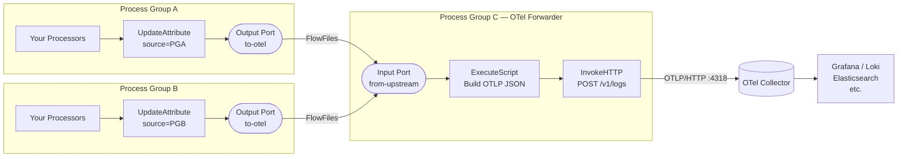
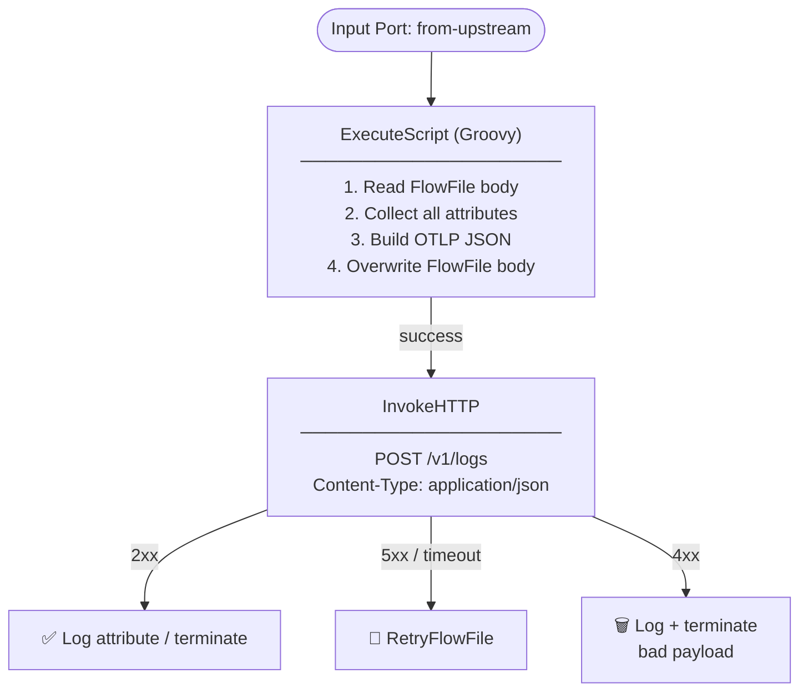
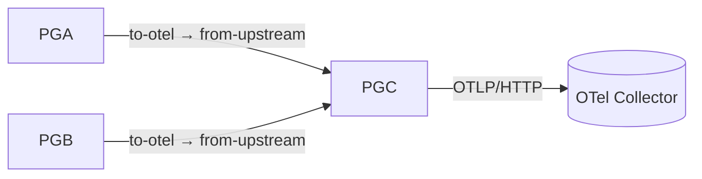
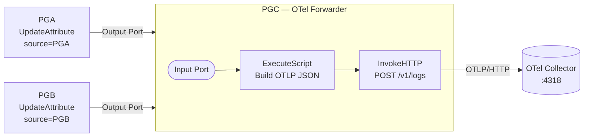

# NiFi → OpenTelemetry — Single Input Port Pattern

Forward FlowFile content and attributes from multiple process groups to an OpenTelemetry collector using a single shared input port in a dedicated OTel forwarder process group.

---

## Table of Contents

- [Overview](#overview)
- [Prerequisites](#prerequisites)
- [Architecture](#architecture)
- [Step-by-step Setup](#step-by-step-setup)
- [ExecuteScript — Groovy](#executescript--groovy)
- [InvokeHTTP Configuration](#invokehttp-configuration)
- [OTLP Payload Reference](#otlp-payload-reference)
- [Filtering in Your OTel Backend](#filtering-in-your-otel-backend)
- [Troubleshooting](#troubleshooting)

---

## Overview

This pattern lets multiple NiFi process groups (PGA, PGB, etc.) send their FlowFile content and attributes to a single dedicated process group (PGC) that packages and forwards them to an OpenTelemetry collector via OTLP/HTTP.

A `source.process.group` attribute stamped in each source group is used as `service.name` in the OTel payload — so you can filter logs in your backend by origin.

> **When to use this pattern**
> Use this when all process groups produce the same type of telemetry and don't need different transformations. If PGA and PGB need different log structures or different OTel endpoints, use separate input ports and processor chains instead.

---

## Prerequisites

- Apache NiFi 2.x
- OpenTelemetry collector deployed and reachable (OTLP/HTTP port `4318`)
- At least two source process groups (PGA, PGB) with flows producing FlowFiles
- NiFi `nifi-groovy-nar` bundle available for `ExecuteScript`
- Network connectivity from NiFi pods to OTel collector service

---

## Architecture

### High-level flow



### Data flow inside PGC



### Parent canvas connections



---

## Step-by-step Setup

### Step 1 — Add UpdateAttribute in PGA

Inside **Process Group A**, add an `UpdateAttribute` processor before the output port.

| Property | Value |
|---|---|
| `source.process.group` | `PGA` |
| `log.severity` | `INFO` *(optional)* |
| `service.name` | `my-service-a` *(optional override)* |

Connect: `[Last Processor] → [UpdateAttribute] → [Output Port]`

---

### Step 2 — Add Output Port in PGA

Drag an **Output Port** onto the PGA canvas.

- Name: `to-otel`

> Use the **exact same name** in all source groups. This makes parent canvas connections easier to identify.

---

### Step 3 — Repeat for PGB

Inside PGB, add the same `UpdateAttribute` with `source.process.group = PGB` and an output port named `to-otel`.

---

### Step 4 — Create PGC with Input Port

Create **Process Group C** (the OTel forwarder group).

Inside PGC:

1. Drag an **Input Port** → name it `from-upstream`
2. Add `ExecuteScript` → configure with Groovy script (see below)
3. Add `InvokeHTTP` → configure POST to OTel endpoint
4. Connect: `[Input Port] → [ExecuteScript] → [InvokeHTTP]`

---

### Step 5 — Connect on the Parent Canvas

Go to the **root canvas** where all three process groups are visible.

1. Hover over **PGA** → drag the connection arrow to **PGC**
    - From output: `to-otel`
    - To input: `from-upstream`
2. Repeat for **PGB** → **PGC**
    - From output: `to-otel`
    - To input: `from-upstream`

Both connections feed the same input port queue. NiFi processes them identically regardless of origin.

---

## ExecuteScript — Groovy

In `ExecuteScript`, set **Script Engine** to `Groovy` and paste the following:

```groovy
import groovy.json.JsonOutput
import java.time.Instant

def flowFile = session.get()
if (!flowFile) return

// Read FlowFile body content
def content = ''
session.read(flowFile, { inputStream ->
    content = inputStream.text
} as InputStreamCallback)

// Exclude noisy NiFi internal attributes
def excludeKeys = [
    'invokehttp.status.code', 'invokehttp.tx.id',
    'invokehttp.response.body', 'invokehttp.status.message',
    'invokehttp.response.url'
]

// Collect ALL FlowFile attributes dynamically
def allAttributes = flowFile.attributes
    .findAll { key, value -> !excludeKeys.contains(key) }
    .collect { key, value ->
        [key: key, value: [stringValue: value]]
    }

// Use source.process.group as service name (set in PGA/PGB UpdateAttribute)
def serviceName = flowFile.getAttribute('source.process.group') ?: 'nifi-pipeline'
def severity    = flowFile.getAttribute('log.severity') ?: 'INFO'

// Build OTLP log payload
def payload = [
    resourceLogs: [[
        resource: [
            attributes: [[
                key  : 'service.name',
                value: [stringValue: serviceName]
            ]]
        ],
        scopeLogs: [[
            scope     : [name: 'nifi'],
            logRecords: [[
                timeUnixNano: (Instant.now().toEpochMilli() * 1_000_000L).toString(),
                severityText: severity,
                body        : [stringValue: content],   // FlowFile body content
                attributes  : allAttributes             // All FlowFile attributes
            ]]
        ]]
    ]]
]

// Overwrite FlowFile body with OTLP JSON — ready for InvokeHTTP
flowFile = session.write(flowFile, { out ->
    out.write(JsonOutput.toJson(payload).getBytes('UTF-8'))
} as OutputStreamCallback)

flowFile = session.putAttribute(flowFile, 'mime.type', 'application/json')
session.transfer(flowFile, REL_SUCCESS)
```

### What this script does

| Step | Description |
|---|---|
| Read body | Reads entire FlowFile content as a string |
| Filter attributes | Excludes internal NiFi/InvokeHTTP noise attributes |
| Collect all attributes | Maps every remaining attribute into OTLP `attributes[]` array |
| Set service.name | Uses `source.process.group` (PGA or PGB) as OTel service name |
| Build OTLP payload | Constructs a valid `resourceLogs` JSON structure |
| Overwrite body | Replaces FlowFile content with OTLP JSON, ready for InvokeHTTP |

---

## InvokeHTTP Configuration

| Property | Value | Note |
|---|---|---|
| **HTTP Method** | `POST` | ⚠️ Default is GET — must change |
| **Remote URL** | `http://<collector>:4318/v1/logs` | See endpoint paths below |
| **Content-Type** | `application/json` | Required |
| Request Body Enabled | `true` | Default |
| Connection Timeout | `5 secs` | |
| Read Timeout | `15 secs` | |
| SSL Context Service | Set if using HTTPS | Optional |

### OTLP endpoint paths

| Signal | Endpoint |
|---|---|
| Logs | `/v1/logs` |
| Traces | `/v1/traces` |
| Metrics | `/v1/metrics` |

### Relationship routing

| Relationship | HTTP Status | Route to |
|---|---|---|
| `Response` (success) | `2xx` | LogAttribute or terminate |
| `Failure` | `5xx` / timeout | RetryFlowFile loop |
| `No Retry` | `4xx` | LogMessage + terminate |

---

## OTLP Payload Reference

The FlowFile body after `ExecuteScript` and posted by `InvokeHTTP`:

```json
{
  "resourceLogs": [{
    "resource": {
      "attributes": [{
        "key": "service.name",
        "value": { "stringValue": "PGA" }
      }]
    },
    "scopeLogs": [{
      "scope": { "name": "nifi" },
      "logRecords": [{
        "timeUnixNano": "1717200000000000000",
        "severityText": "INFO",
        "body": {
          "stringValue": "<original FlowFile content>"
        },
        "attributes": [
          { "key": "uuid",                 "value": { "stringValue": "abc-123" } },
          { "key": "filename",             "value": { "stringValue": "orders.json" } },
          { "key": "source.process.group", "value": { "stringValue": "PGA" } },
          { "key": "path",                 "value": { "stringValue": "./" } }
        ]
      }]
    }]
  }]
}
```

---

## Filtering in Your OTel Backend

Because `source.process.group` is mapped to `service.name` in the OTel resource, you can filter by origin in any OTel-compatible backend:

**Grafana / Loki**
```logql
{service_name="PGA"}
{service_name="PGB"}
```

**Elasticsearch / OpenSearch**
```json
{ "query": { "term": { "resource.attributes.service.name": "PGA" } } }
```

**Adding more process groups later**

To add PGC, PGD, etc. as sources in the future:
1. Add `UpdateAttribute` with `source.process.group = PGC` in the new group
2. Add an output port named `to-otel`
3. On the parent canvas connect to PGC's `from-upstream` input port
4. No changes needed to the ExecuteScript or InvokeHTTP — they are source-agnostic

---

## Troubleshooting

| Symptom | Cause | Fix |
|---|---|---|
| `405 Method Not Allowed` | InvokeHTTP using GET instead of POST | Set **HTTP Method** to `POST` |
| `400 Bad Request` | Malformed OTLP JSON | Check FlowFile body doesn't contain unescaped quotes or newlines |
| Connection refused | Collector not reachable from NiFi pod | Verify collector service DNS + port. `kubectl exec` into NiFi pod and `curl` the endpoint |
| FlowFile stuck in queue | ExecuteScript error | Check NiFi Bulletin Board for Groovy stack trace |
| No logs in OTel backend | Collector not forwarding | Add `debug` exporter to collector config and tail pod logs |
| `service.name` shows `nifi-pipeline` | `source.process.group` attribute not set | Check `UpdateAttribute` is connected before the output port in PGA/PGB |

### Verify collector is receiving data

```bash
# Tail OTel collector pod logs
kubectl logs -n telemetry-stack -l app=opentelemetry-collector -f
```

Add a `debug` exporter to your collector config to print full payloads:

```yaml
exporters:
  debug:
    verbosity: detailed

service:
  pipelines:
    logs:
      receivers: [otlp]
      processors: [batch]
      exporters: [debug]       # add alongside your existing exporter
```

```bash
# Restart collector to pick up config
kubectl rollout restart deployment/opentelemetry-collector -n telemetry-stack
```

---

## Summary


