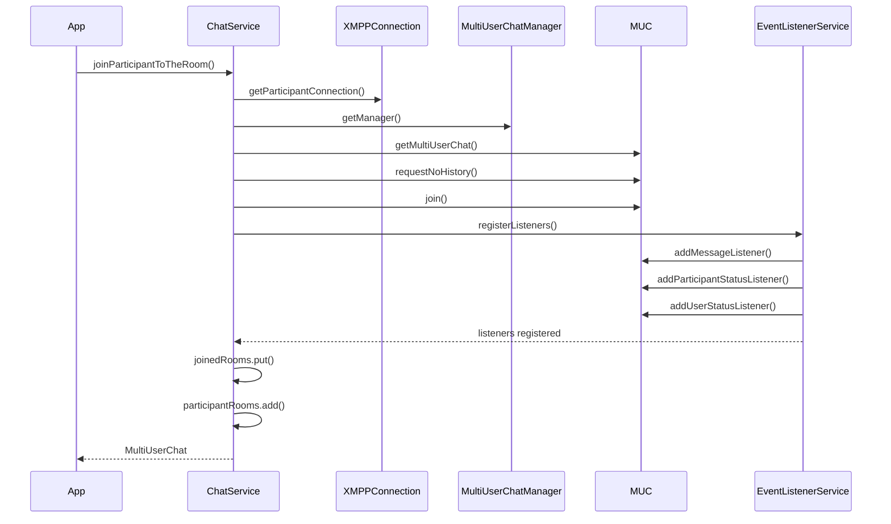
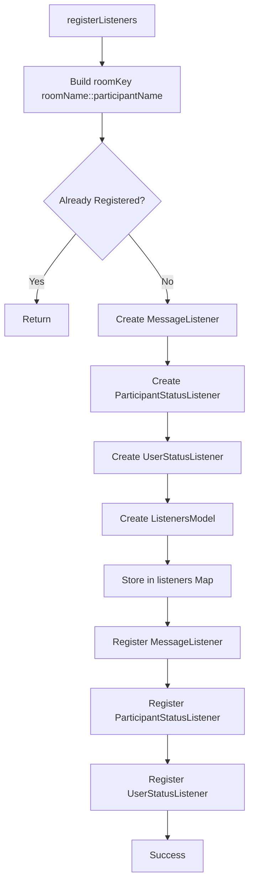
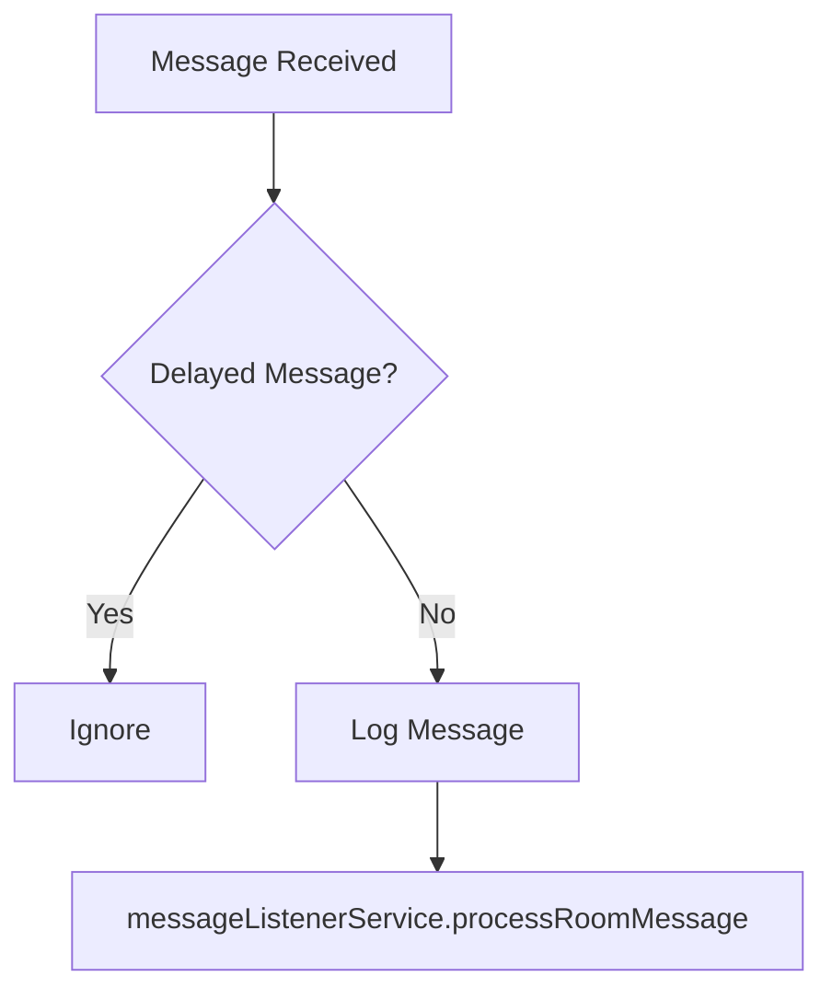
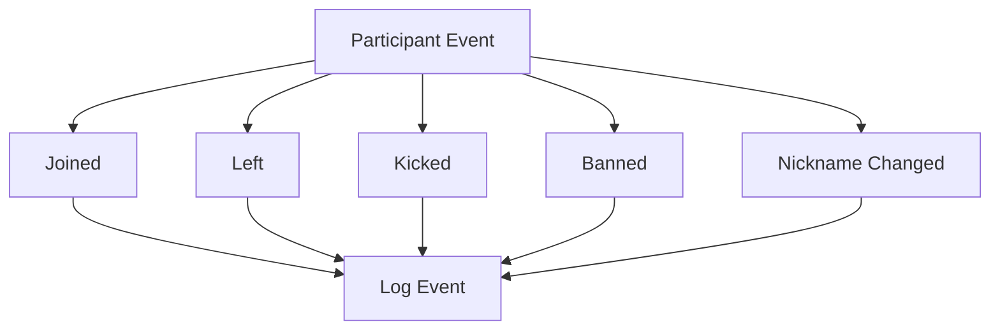
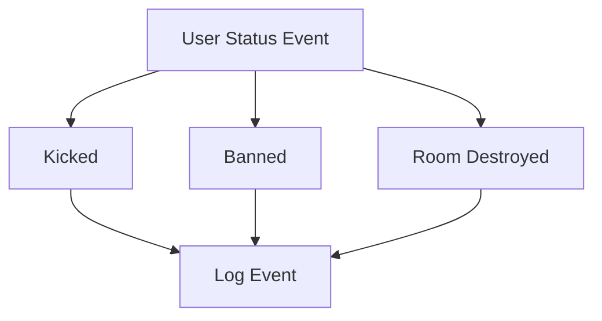
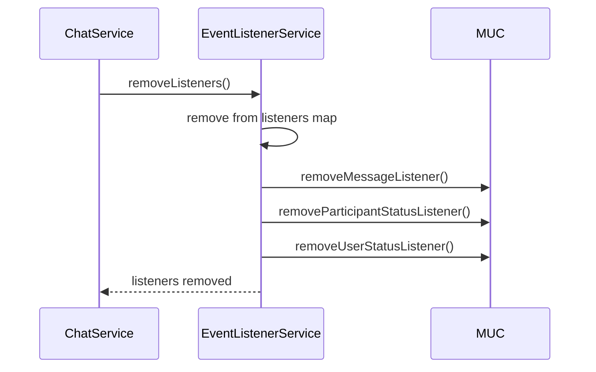
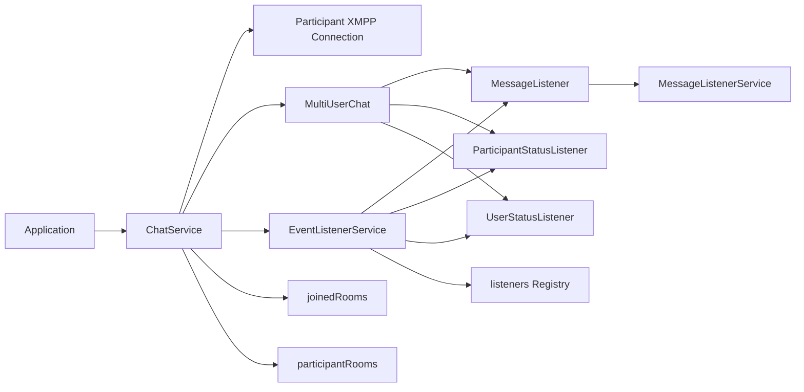

OpenFire MUC Event Listener Architecture

Overview

This implementation provides a wrapper around Smack’s MultiUserChat API to:

* Join a participant to a room
* Register room-specific listeners
* Process real-time messages
* Track participant join/leave events
* Track room lifecycle events
* Remove listeners when a participant leaves
* Prevent duplicate listener registration

⸻

Components

ChatService

Responsible for:

* Creating participant XMPP connections
* Joining rooms
* Building MUC enter configuration
* Registering listeners
* Tracking joined rooms

Key method:

```
joinParticipantToTheRoom(String roomName, String participantName)

```
EventListenerService

Responsible for:

* Creating listeners
* Registering listeners to a room
* Removing listeners
* Managing listener lifecycle

Listeners registered:

```
MessageListener
ParticipantStatusListener
UserStatusListener
```

ListenersModel

Stores all listeners associated with a room-participant pair.

```java
public class ListenersModel {
    private MessageListener messageListener;
    private ParticipantStatusListener participantStatusListener;
    private UserStatusListener userStatusListener;
}
```


Join Flow




Listener Registration Flow




Message Processing Flow

Historical messages are ignored using:

```java

DelayInformation.from(message)
```

Only real-time messages are processed.




Participant Event Flow




User Status Event Flow

These events apply to the currently logged-in participant.




Listener Removal Flow




Internal Data Structures

Joined Rooms

Used to track active MUC sessions.


```java
Map<String, MultiUserChat> joinedRooms
```


Example key:

```
roomA::john
```


Participant Rooms

Used to track which rooms a participant belongs to.

```java
Map<String, Set<String>> participantRooms
```

Example:

```
john
 ├─ roomA
 ├─ roomB
 └─ roomC
```


Listener Registry

Prevents duplicate listener registration.


```java
Map<String, ListenersModel> listeners

```


Example:

```
roomA::john
    ├─ MessageListener
    ├─ ParticipantStatusListener
    └─ UserStatusListener
```


Use Cases

⸻

Use Case 1 - User Joins Chat Room

Scenario

A user joins an existing room.

Flow

1. Create participant connection.
2. Join room without history.
3. Register listeners.
4. Store room mappings.

Outcome

User receives only new messages and room events.

⸻

Use Case 2 - Receive Real-Time Room Messages

Scenario

Another participant sends a message.

Flow

1. MessageListener receives event.
2. Check for DelayInformation.
3. Ignore historical messages.
4. Forward message to MessageListenerService.

Outcome

Only live chat messages are processed.

⸻

Use Case 3 - Participant Leaves Room

Scenario

Participant exits the room.

Flow

1. OpenFire emits left() event.
2. ParticipantStatusListener receives event.
3. Event is logged.
4. Cleanup can be triggered if required.

Outcome

Participant departure is tracked.

⸻

Use Case 4 - Participant Gets Kicked

Scenario

Moderator removes a participant.

Flow

1. OpenFire emits kicked() event.
2. ParticipantStatusListener receives event.
3. Actor and reason are logged.

Outcome

Audit trail is available.

⸻

Use Case 5 - Room Destroyed

Scenario

Administrator deletes room.

Flow

1. OpenFire emits roomDestroyed().
2. UserStatusListener receives event.
3. Room destruction reason is logged.
4. Cleanup process can be initiated.

Outcome

Application becomes aware that the room no longer exists.

⸻

Design Considerations

Advantages

* Prevents duplicate listener registration.
* Ignores historical messages.
* Supports listener cleanup.
* Easy to extend with additional event handlers.
* Thread-safe listener registry using ConcurrentHashMap.

Future Improvements

* Register one message listener per room instead of per participant.
* Publish events to Kafka/Event Bus.
* Add metrics and tracing.
* Persist room membership state.
* Automatic listener recovery after reconnect.
* Support message archive retrieval (MAM) when required.


Architecture Diagram


