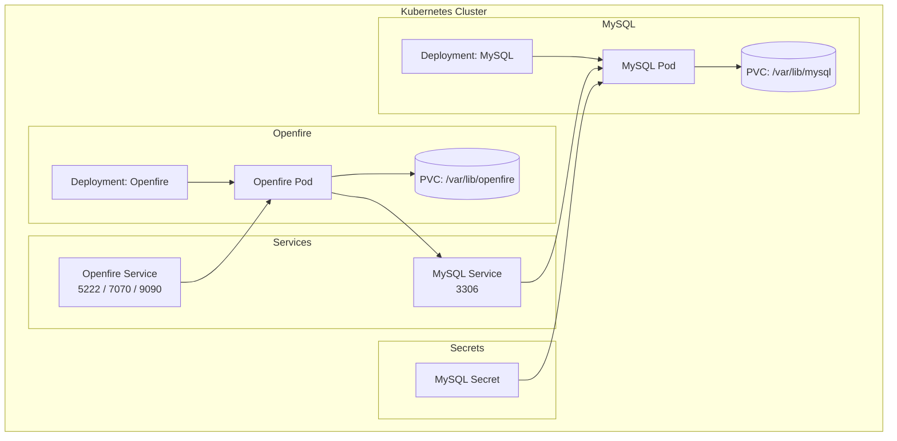
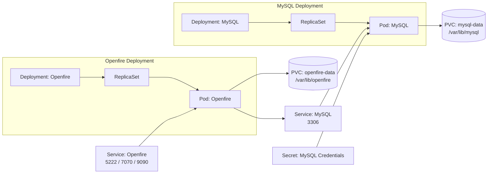

# Openfire Deployment Design (Wiki)

## Overview

This deployment provisions an XMPP-based chat system using:
•	Openfire → XMPP server
•	MySQL → persistent database
•	Kubernetes (Kustomize + ArgoCD) → deployment orchestration


## Repository Structure

```
openfire/
├── argocd-files/
│   ├── dev-1/
│   └── sil-direct/
├── base-manifests/
│   ├── openfire-deployment.yaml
│   ├── openfire-service.yaml
│   ├── openfire-mysql.yaml
│   ├── openfire-mysql-service.yaml
│   ├── openfire-mysql-secret.yaml
│   ├── openfire-mysql-pv.yaml
│   ├── openfire-mysql-pvc.yaml
│   ├── openfire-conf-pv.yaml
│   ├── openfire-conf-pvc.yaml
│   ├── openfire-cm.yaml
│   └── kustomization.yaml
├── env/
│   ├── dev-1/
│   └── sil-direct/
```

Components

1. Openfire Deployment
   •	Image: openfire-image
   •	Ports:
   •	5222 → XMPP client
   •	7070 → HTTP binding
   •	9090 → Admin console
   •	Persistent storage:

```aiignore
/var/lib/openfire
```

MySQL Deployment
•	Image: mysql:8
•	Port: 3306
•	Credentials via Kubernetes Secret


Services

Openfire Service
•	Exposes:
•	5222 (XMPP)
•	7070 (HTTP)
•	9090 (Admin)

MySQL Service
•	NodePort: 30306
•	Internal access:

```aiignore
openfire-mysql:3306
```

4. Persistent Storage

Component
PVC
Mount Path
Openfire
openfire-conf-pvc
/var/lib/openfire
MySQL
openfire-mysql-pvc
/var/lib/mysql


## Secrets

```aiignore

MYSQL_ROOT_PASSWORD
MYSQL_DATABASE
MYSQL_USER
MYSQL_PASSWORD
```


Stored in:
```aiignore
openfire-mysql-secret.yaml
```

## Deployment Flow

Step 1: Apply Base Manifests

Handled via:

```

kustomization.yaml
```
Includes:
•	Storage (PV/PVC)
•	MySQL
•	Openfire
•	Services
•	ConfigMap


Step 2: Environment Overlay

Example:

```aiignore

env/dev-1/kustomization.yaml
```

Adds:
•	Image overrides
•	Namespace
•	Affinity rules


Step 3: ArgoCD

```aiignore
argocd-openfire-application.yaml

```

Deploys automatically from Git

## Deployment Architecture (Kubernetes Only)




## Deployment + Storage View (More Infra Focused)




args:
- |
  echo "Parsing DB URL..."

  DB_HOST=$(echo $OPENFIRE_DB_URL | sed -E 's|jdbc:mysql://([^:/]+).*|\1|')
  DB_PORT=$(echo $OPENFIRE_DB_URL | sed -E 's|.*:([0-9]+)/.*|\1|')

  echo "Waiting for MySQL at $DB_HOST:$DB_PORT..."

  until nc -z $DB_HOST $DB_PORT; do
  echo "MySQL not ready, retrying..."
  sleep 4
  done

  echo "MySQL is ready!"
