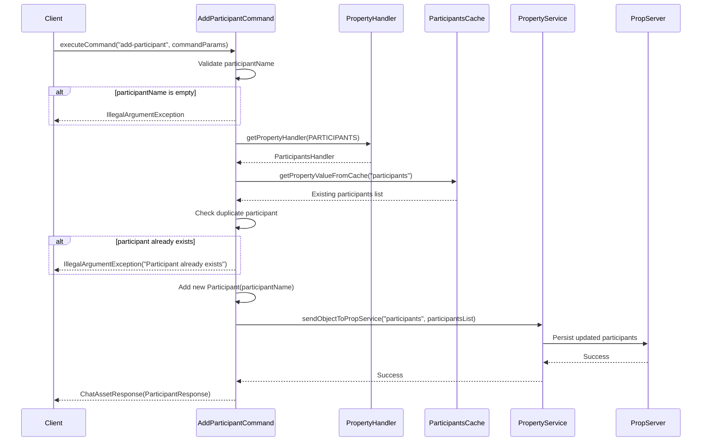
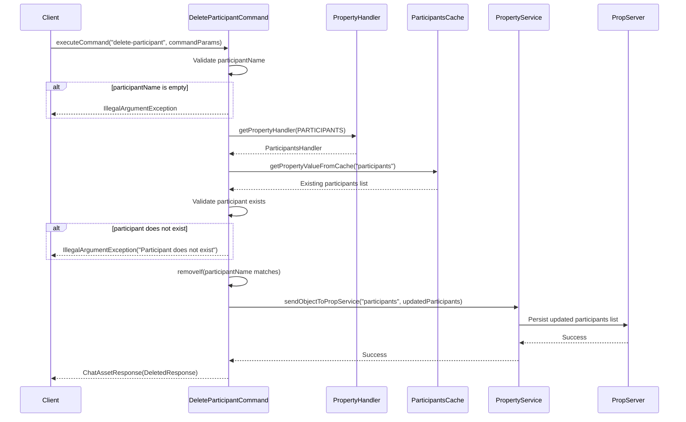

In XMPP, a participant has a specific meaning — it refers to a user who has joined a room. Participants are therefore tightly coupled to room membership.

As such, XMPP does not define the concept of “global participants” outside the context of rooms.

To support this requirement, we can maintain a global participant list at the service level by persisting it in the Prop Server database and using it when managing room participation.
