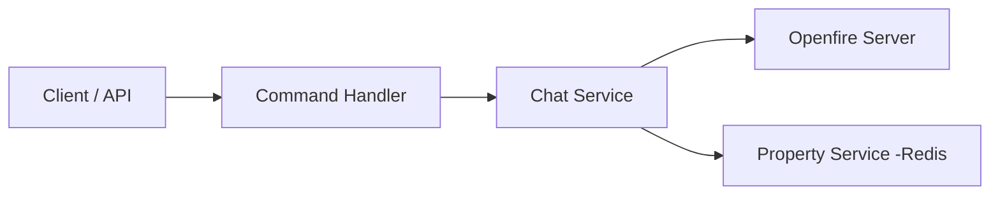
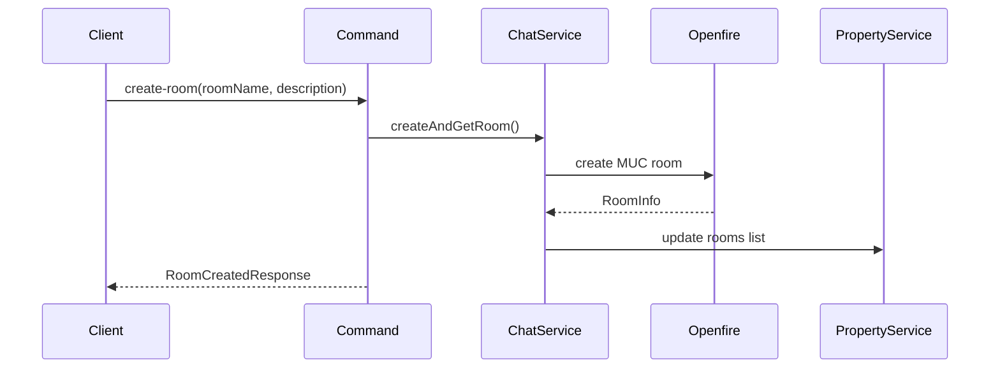
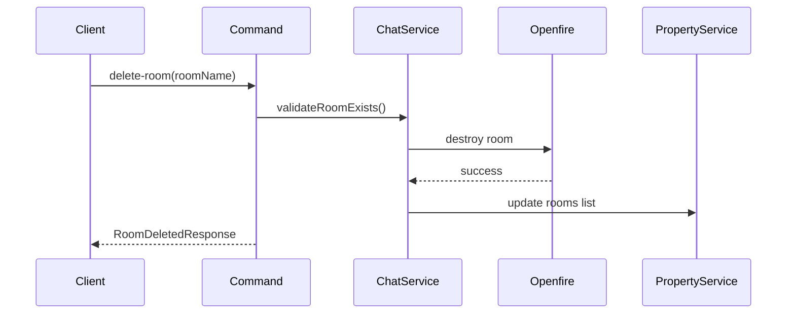
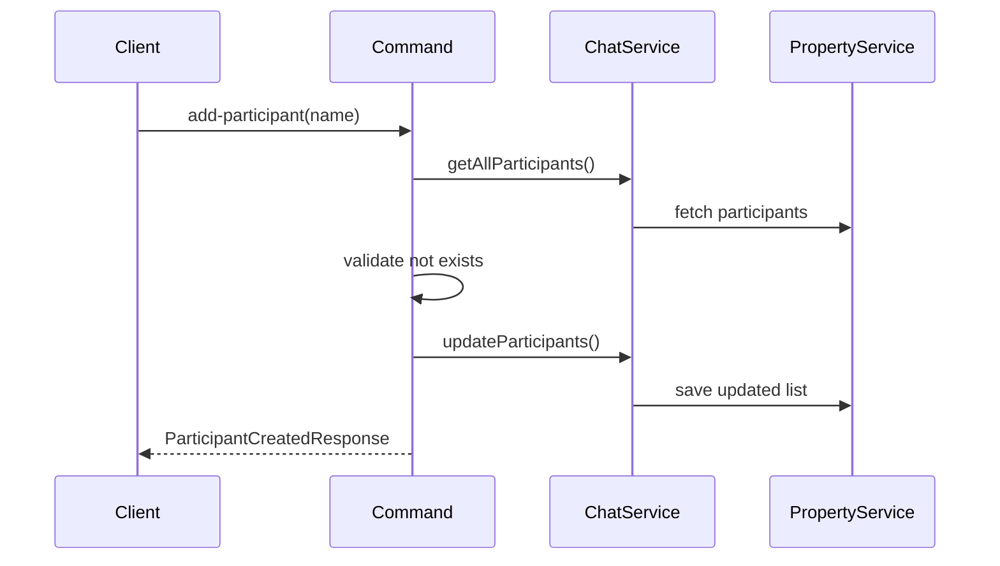
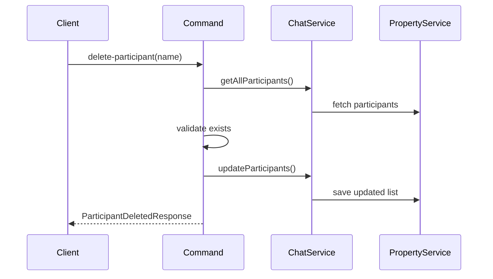
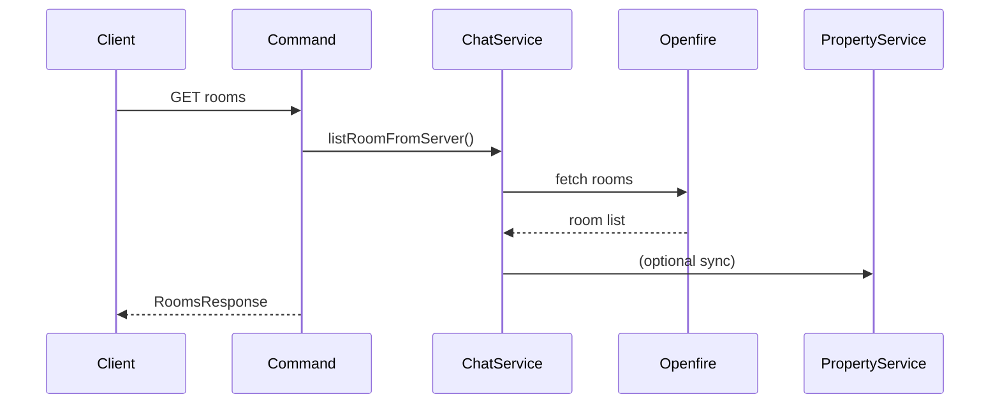
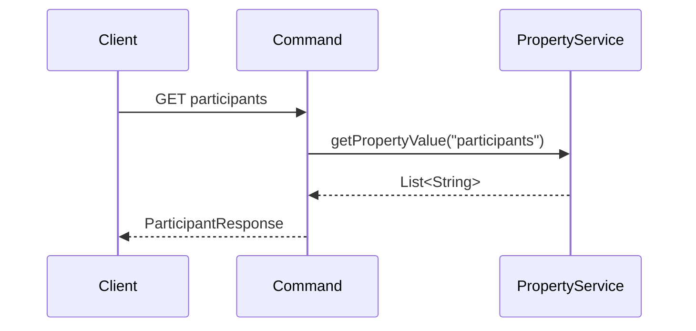
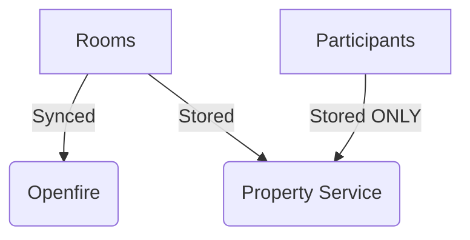

# Chat Traffic Gateway – Commands & Properties Flow 

## Overview

This service manages:
 - Rooms → synced with Openfire + Property Service
 - Participants → managed ONLY via Property Service (no Openfire calls)


## Architecture Summary




### Command Responsibilities

|| Command || Openfire || Property Service ||
| create-room | Yes | Yes |
| delete-room | Yes | Yes |
| add-participant | No | Yes |
| delete-participant | No | Yes |
| rooms (GET) | Yes | Yes |
| participants (GET) | No | Yes |


### 1. Create Room



Key Points
•	Validates:
•	roomName
•	description
•	Prevents duplicate rooms
•	Syncs result into Property Service


### 2. Delete Room

Flow




Key Points
•	Room existence validated first
•	Openfire is the source of truth
•	Property Service updated after deletion


### 3. Add Participant


#### Flow 




Key Points
 - Stored as:

```json
["user1", "user2"]
```

 - No Openfire membership
 - Duplicate check enforced


### 4. Delete Participant

#### Flow 




Key Points
 - Throws error if user not found
 - Pure Property Service operation


### 5. Get Rooms
#### Flow




### 6. Get Participants

#### Flow 




### Data Models

#### Participants

```json
{
  "participants": [
    "Saneera",
    "John"
  ]
}
```

### Rooms

```json
{
  "rooms": [
    {
      "roomName": "Test1",
      "description": "Room description"
    }
  ]
}
```


### Validation Rules

### Room
 - name cannot be null/empty
 - description cannot be null/empty
 - must not already exist

### Participant
 - name cannot be null/empty
 - must not already exist (add)
 - must exist (delete) 


### Final Architecture Insight




### Summary
 -	Rooms → Openfire + Property Service
 - Participants → Property Service ONLY
 - Commands are clearly separated
 - No unnecessary XMPP calls
